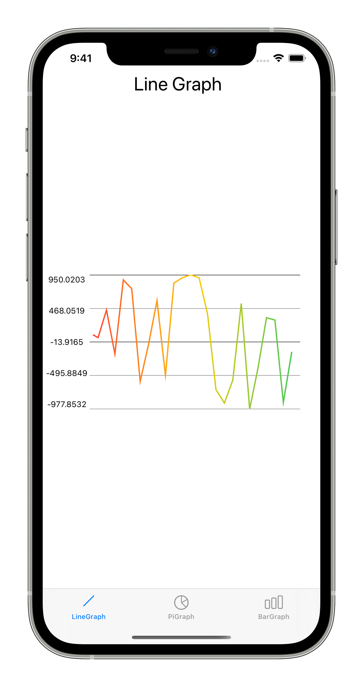
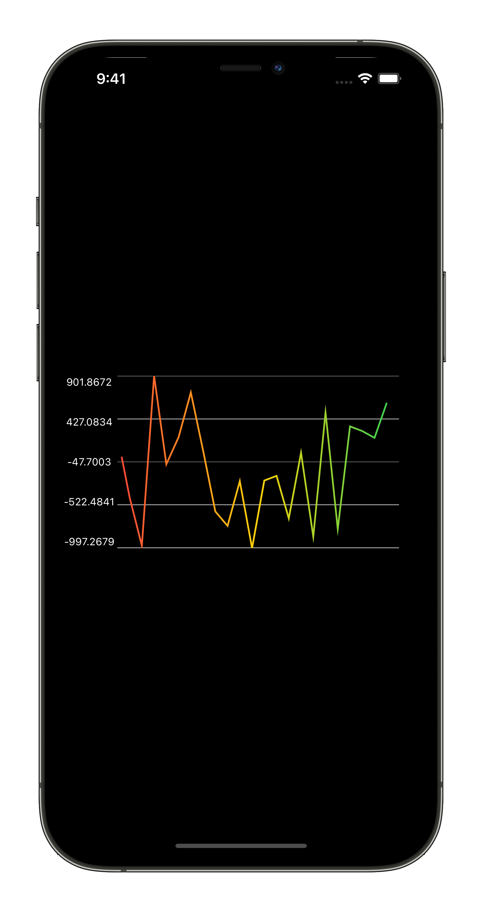
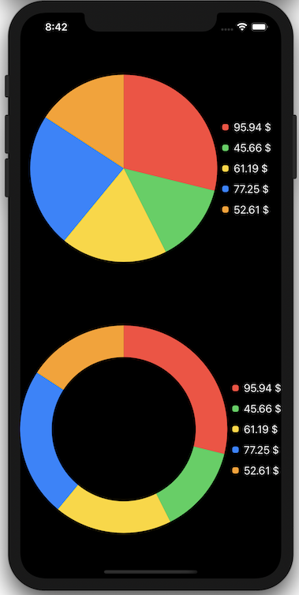
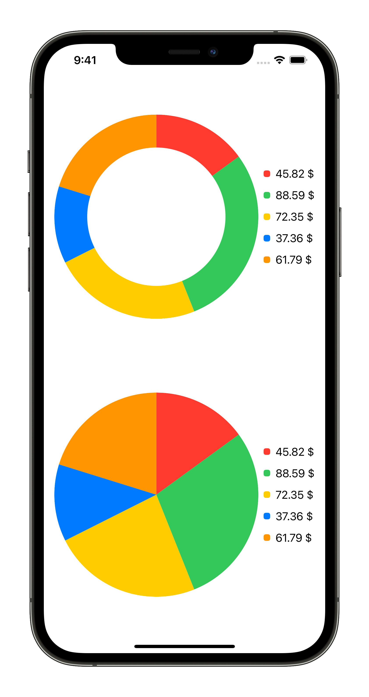
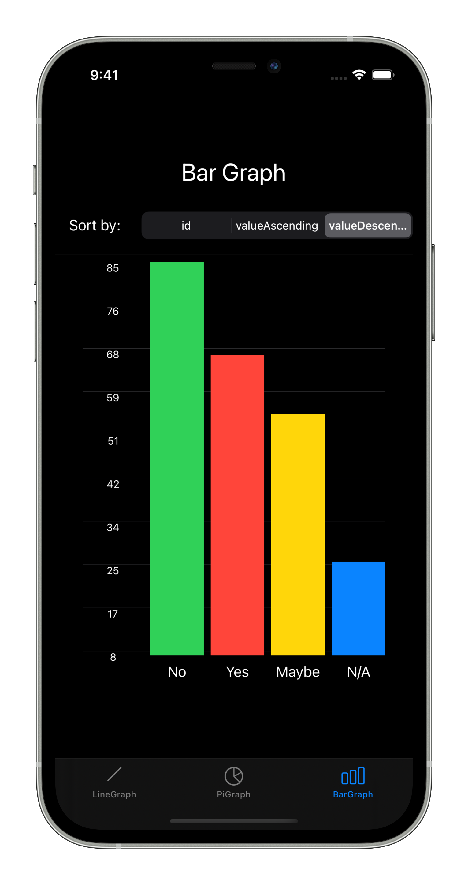
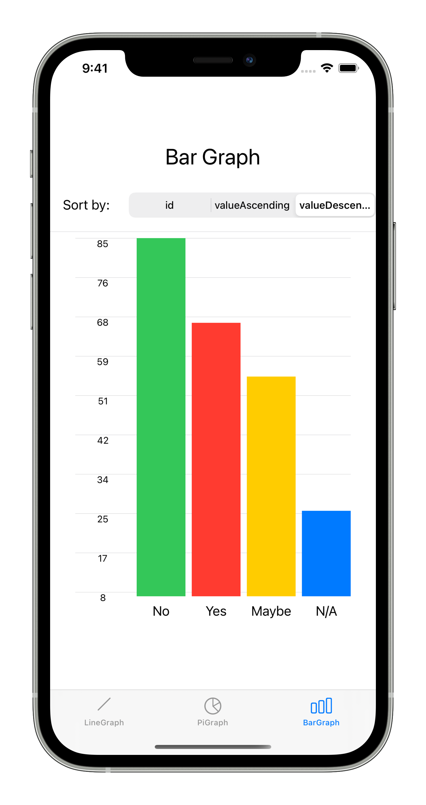

# SwiftUIGraph

SwiftUIGraph is a Swift package to display static or dynamic Graphs with SwiftUI.

## Supported graphs

* Line Graphs
* Pie Graph
* Donut Graph
* Bar Graph

## Supported OS

* iOS 13
* iPadOS 13
* macOS 10.15
* tvOS 13
* watchOS 6

# Installation

In Xcode 11 got to `File -> Swift Packages -> Add Package Dependency..` and paste the package url: `https://github.com/Volker88/SwiftUIGraph`

# LineGraph
1. Import SwiftUIGraph
2. Add **LineGraphProtocol** protocol to your SwiftUI View Struct
    * **lineGraphSettings** needs to be added for customizaion of the graph
3. Implement **LineGraphView()** and pass in your **lineGraphSettings** and an Array containing the Points to generate the Graph

### Example

~~~~swift
import SwiftUI
import SwiftUIGraph

struct ContentView: View, LineGraphProtocol {
    @State var lineGraphPointsArray: [Double] = [-10,-5,-5,0,0,5,5,10,5,5,0,0,-5,-5]
    var lineGraphSettings: LineGraphSettings = LineGraphSettings(maxPoints: 25, decimalDigits: 2, lineWidth: 2, lineColor: [.red,.yellow,.green], textColor: .primary)

    var body: some View {
        GeometryReader { g in
            LineGraphView(lineGraphPointsArray: self.lineGraphPointsArray, lineGraphSettings: self.lineGraphSettings, graphWidth: g.size.width - 20, graphHeight: g.size.height / 2)
        }
    }
}
~~~~

## Customization

* **maxPoints**: Maximum items in the array. In case of dynamic graphs only the last *n* values will be shown on the graph
* **decimalDigits**: Limit decimal digits to **n** digits
* **lineWidth**: Width of the graph line
* **lineColor**: Array of **[Color]** to use one or multiple colors to make the line more colorful
* **textColor**: Color of the Values

## Preview

# PieGraph

1. Import SwiftUIGraph
2. Implement **PieGraphView()** and pass in your Data Points to generate the Graph

### Example

~~~~swift
import SwiftUI
import SwiftUIGraph

struct ContentView: View {
    
    @State private var redAmount = Double.random(in: 10...100)
    @State private var greenAmount = Double.random(in: 10...100)
    @State private var yellowAmount = Double.random(in: 10...100)
    @State private var blueAmount = Double.random(in: 10...100)
    @State private var orangeAmount = Double.random(in: 10...100)
    
    var data: [PieDataPoint] {
        [
            PieDataPoint(id: 1, value: redAmount, valueType: "$", color: .red),
            PieDataPoint(id: 2, value: greenAmount, valueType: "$", color: .green),
            PieDataPoint(id: 3, value: yellowAmount, valueType: "$", color: .yellow),
            PieDataPoint(id: 4, value: blueAmount, valueType: "$", color: .blue),
            PieDataPoint(id: 5, value: orangeAmount, valueType: "$", color: .orange)
        ]
    }
    
    var body: some View {
        VStack {
            PieGraphView(dataArray: data)
                .padding()
            PieGraphView(dataArray: data, lineWidth: 50)
        }
    }
}

~~~~

## Customization

* **lineWidth**: Pass in a value to generate a donut graph

## Preview

# BarGraph

1. Import SwiftUIGraph
2. Implement **BarGraphView()** and pass in your Data Points to generate the Graph

### Example

~~~~swift
import SwiftUI
import SwiftUIGraph

struct ContentView: View {
    @State private var redAmount = Double.random(in: 10...100)
    @State private var yellowAmount = Double.random(in: 10...100)
    @State private var greenAmount = Double.random(in: 10...100)
    @State private var blueAmount = Double.random(in: 10...100)

    var data: [BarDataPoint] {
        [
            BarDataPoint(id: 1, value: redAmount, color: .red, title: "Yes"),
            BarDataPoint(id: 2, value: yellowAmount, color: .yellow, title: "Maybe"),
            BarDataPoint(id: 3, value: greenAmount, color: .green, title: "No"),
            BarDataPoint(id: 4, value: blueAmount, color: .blue, title: "N/A")
        ]
    }

    var body: some View {
        BarGraphView(dataPoints: data, horizontalLines: 10, sortedBy: .valueAscending)
    }
}

~~~~

## Customization

* **horizontalLines**: default 10
* **sortedBy**: optional, if nothing passed the order of the array will be taken

## Preview

