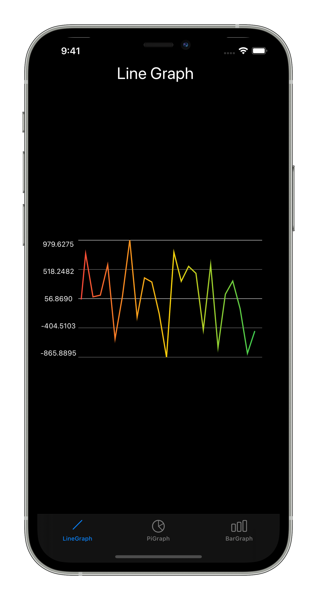

# SwiftUIGraph

SwiftUIGraph is a Swift package to display static or dynamic Graphs with SwiftUI.

## Supported graphs

* Line Graphs

## Supported OS

* iOS 13
* iPadOS 13
* macOS 10.15
* tvOS 13
* watchOS 6

## Installation

In Xcode 11 got to `File -> Swift Packages -> Add Package Dependency..` and paste the package url: `https://github.com/Volker88/SwiftUIGraph`

1. Import SwiftUIGraph
2. Add **LineGraphProtocol** protocol to your SwiftUI View Struct
    * **lineGraphSettings** needs to be added for customizaion of the graph
3. Implement **LineGraphView()** and pass in your **lineGraphSettings** and an Array containing the Points to generate the Graph

### Example

~~~~swift
import SwiftUI
import SwiftUIGraph

struct ContentView: View, LineGraphPotocol {
    @State var lineGraphPointsArray: [Double] = [-10,-5,-5,0,0,5,5,10,5,5,0,0,-5,-5]
    var lineGraphSettings: LineGraphSettings = LineGraphSettings(maxPoints: 25, decimalDigits: 2, lineWitdh: 2, lineColor: [.red,.yellow,.green], textColor: .primary)

    var body: some View {
        GeometryReader { g in
            LineGraphView(lineGraphPointsArray: self.lineGraphPointsArray, lineGraphSettings: self.lineGraphSettings, graphWidth: g.size.width - 20, graphHeight: g.size.height / 2)
        }
    }
}
~~~~

## Customization

* **maxPoints**: Maximum items in the array. In case of dynamic graphs only the last *n* values will be shown on the graph
* **decimalDigits**: Limit decimal digits to **n** digits
* **lineWidth**: Width of the graph line
* **lineColor**: Array of **[Color]** to use one or multiple colors to make the line more colorful
* **textColor**: Color of the Values

## Dark Mode

